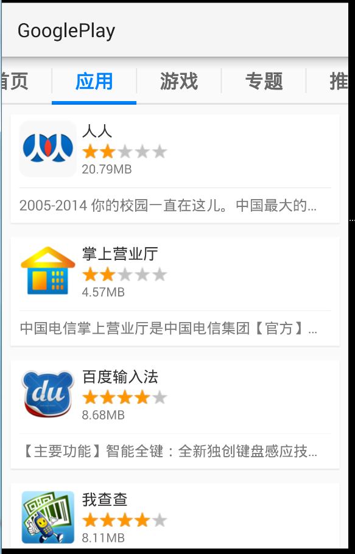

# GooglePlay (只是个名字，别纠结)
##练习项目，模仿实现一个应用市场的应用，实现部分功能
###网络请求使用的是XUtils https://github.com/wyouflf/xUtils
###图片加载使用的是Universal-Image-Loader https://github.com/nostra13/Android-Universal-Image-Loader
###还有Fragment的使用 
### 后台数据是自己使用tomcat弄的，演示不了，所以然并卵o(╯□╰)o
 
